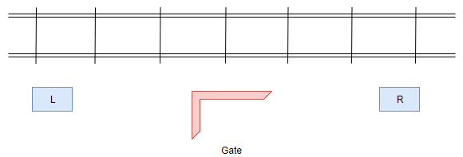

# Railway Crossing by 2 Ultrasonic Sensors

The railway model in Zusebau room 2045 should be extended by a Crossing Gate. The gate will be operated by a servo motor, a train has to be detected by sensors before and after the crossing. The gate should be open when no train is in the area, the gate should be closed as soon as a train is on or near the crossing. Under no circumstances can the gate be open while a train is passing. Think about the right set of sensors to assure this requirement. During this task, modifications to the railway model are not allowed or needed.

## Requirements
Requirements | Functional
------------ | ----------
Must-have | <ul><li>The crossing gate is open when no train is coming near the gate.</li><li>The crossing gate is closed when there is a train coming to the gate.</li><li>The crossing gate is open again when the train passes the gate.</li><li>Train can stop between the sensors.</li></ul>

## Schematics (Fritzing)
> schematics/schematics.fzz

## List of Components
Name | Type | Quantity
---- | ---- | --------
Arduino UNO | Microcontroller board | 1
Servo motor | Servo motor | 1
HC-SR04 | Ultrasonic sensor | 2
Red light | LED Red | 1
220Ohm resistor | Resistor | 1
Wires | -- | --

## Setup

## State machine

2 ultrasonic sensors are placed at position L (left) and R (right)  

## Firmware (Arduino)

> firmware/firmware.ino